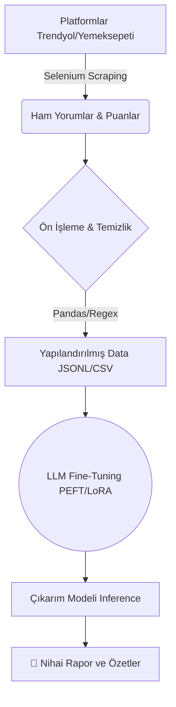

<div align="center">
  <h1>🍽️ Restorant AI</h1>
  <h3>Restoran Karar Destek ve Müşteri Analiz Sistemi</h3>

  <p align="center">
    <a href="https://huggingface.co/spaces/emirdfg/Restorant_Ai"><strong>Hugging Face Canlı Demo</strong></a> ·
    <a href="https://drive.google.com/drive/folders/1Y6mVlSS3_nrOZhbY5aUT-LlvgO-_gXsQ?hl=tr"><strong>Büyük Veri Setleri (Google Drive)</strong></a>
  </p>

  
  
  
  
  
</div>

<br/>

## 📖 Proje Hakkında

**Restorant AI**, Türkiye'nin önde gelen yemek sipariş platformlarındaki (Trendyol Yemek, Yemeksepeti) binlerce müşteri geri bildirimini ve restoran metriklerini otomatik toplayıp, Büyük Dil Modelleri (LLM) aracılığıyla analiz eden uçtan uca bir makine öğrenmesi ve veri madenciliği çözümüdür.

Bu sistem sayesinde, karmaşık ve okunması saatler sürecek olan müşteri eleştirileri saniyeler içerisinde **Lezzet, Hız ve Servis** odaklı objektif bir formata dönüştürülerek okunabilir yönetici özetleri (Executive Summary) haline getirilir. Hem restoran işletmecilerine iyileştirme için stratejik veriler sunar, hem de tüketicilerin doğru karar almasına destek olur.

---

## ✨ Temel Özellikler (Core Features)

- 🕷️ **Otonom Veri Madenciliği (Web Scraping):** Selenium ve BeautifulSoup altyapısıyla Trendyol ve Yemeksepeti platformlarındaki dinamik sayfaları (Infinite Scroll, Pagination) aşarak yorum ve restoran meta verilerini çeker.
- 🧹 **Gelişmiş Veri Ön İşleme (ETL Pipeline):** Ham HTML ve DOM objelerini temizler, aykırı verileri kaldırır ve NLP modelleri için uygun yapılandırılmış formatlara (JSONL, CSV) çevirir.
- 🧠 **Yapay Zeka & NLP Entegrasyonu:**
  - Özel veri seti ile sıfırdan oluşturulan dil modelleri.
  - **Mistral-7B / LLaMA Entegrasyonu:** Daha derinlemesine duygu durum (Sentiment) ve özetleme analizleri için PEFT ve LoRA kullanılarak işletmeye özel eğitilmiş (Fine-tuned) son teknoloji modeller.
- 📊 **Karar Destek Sistemi Desteği:** Toplanan yüksek hacimli veriler ışığında, restoranın spesifik eksiklerini ve müşteri şikayet trendlerini saptayıp raporlar.

---

## 🏗️ Proje Mimarisi

Aşağıdaki şema, sistemin uçtan uca işleyiş mantığını özetlemektedir:



---

## 📂 Dizin Yapısı (Klasör Organizasyonu)

Proje hiyerarşisi, modülerlik ilkelerine bağlı kalınarak organize edilmiştir. Daha detaylı bilgiler için klasör içi `README.md` dosyalarını inceleyebilirsiniz.

```text
Restorant_KDS/
└── restorant_kds/
    ├── comment_scraping/            # Müşteri yorumlarını kazıyan otomasyonlar (Trendyol, Yemeksepeti)
    ├── restoran_info_scraping/      # İşletme bazlı meta verileri (Puan, Teslimat) kazıyan modül
    ├── llm_ai_model/                # Model eğitimi öncesi veri hazırlığı ve tokenizasyon adımları
    ├── llm_fine_tuning/             # Büyük Dil Modellerinin (Mistral vb.) Lora checkpoint'leri ile eğitimi
    └── final_model/                 # Eğitimi bitmiş, canlıya alınmaya (deployment) hazır adaptörler
```

---

## 🛠️ Kullanılan Teknolojiler (Tech Stack)

| Kategori | Teknoloji / Araç |
| :--- | :--- |
| **Dil & Betik** | Python 3.8+ |
| **Veri Toplama (Web Kazıma)** | WebDriver (Selenium) |
| **Veri Analizi ve Manipülasyonu** | Pandas, NumPy, Regex |
| **Derin Öğrenme / AI** | PyTorch, Hugging Face Transformers, `peft`, `trl`, BitsAndBytes |
| **Görselleştirme** | Matplotlib, Seaborn (Jupyter defterleri) |

---

## 🚀 Başlarken (Getting Started)

### 1. Depoyu Klonlayın
```bash
git clone https://github.com/KULLANICI_ADINIZ/Restorant_KDS.git
cd Restorant_KDS
```

### 2. Gerekli Kütüphaneleri Yükleyin
Virtual environment (Sanal ortam) kullanmanız tavsiye edilir:
```bash
pip install -r requirements.txt
```
*(Not: Model eğitimi (Fine-Tuning) adımları çalıştırılacaksa sisteminizde CUDA (NVIDIA GPU) kurulu olması büyük avantaj sağlar.)*

### 3. Model Ağırlıklarını ve Veri Setlerini İndirin
GitHub dosya boyutu limitlerinden ötürü, 100MB'ı aşan .jsonl eğitim setlerini ve binlerce adım eğitilmiş model ağırlığını (Adapter) yerelinize almak için:
🔗 **[Google Drive Bağlantısından Dosyaları İndirin](https://drive.google.com/drive/folders/1Y6mVlSS3_nrOZhbY5aUT-LlvgO-_gXsQ?hl=tr)**
*(İndirdiğiniz klasörleri ilgili dizinlerin içerisine yerleştiriniz)*

### 4. Scraping İşlemlerini Test Etme
Örnek olarak Yemeksepeti üzerinden pizza satan mağazaların yorumlarını kazımak için:
```bash
cd restorant_kds/comment_scraping/yemeksepeti_yorumlar
python yemeksepeti_pizza_yorumlar.py
```

---

## ⚖️ Yasal Uyarı
Bu proje tamamen **akademik** eğitim ve doğal dil işleme deneyleri amacıyla geliştirilmiştir. Çekilen veriler e-ticaret platformlarının son kullanıcı sözleşmelerine veya veri politikalarına tabi olabilir. Web kazıma sırasında aşırı trafik çekmekten (DDoS etkisi) kaçının ve daima kurallara uyun.
